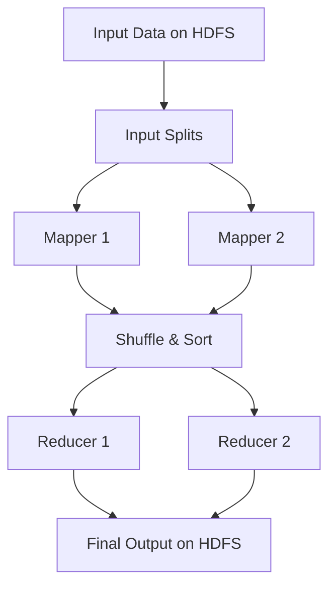
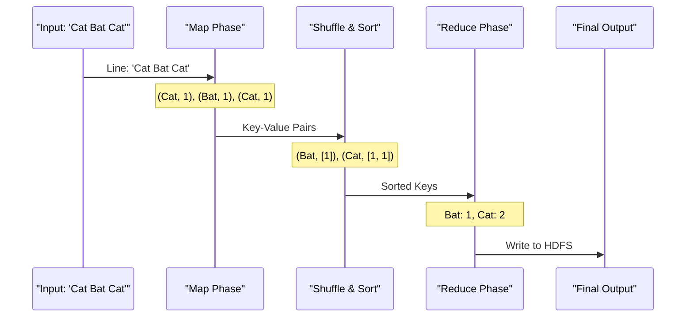

# Understanding MapReduce

MapReduce is a programming model and processing technique for distributed computing. It allows for the processing of massive datasets in parallel across a cluster.

## 1. How MapReduce Works

The process is divided into three main phases: **Map**, **Shuffle & Sort**, and **Reduce**.

### Workflow Diagram



### Detailed Word Count Example



---

## 2. Student Task: Coding the MapReduce Job

Your objective is to create the Python scripts required to perform a distributed Word Count. This is a classic "Hello World" example in Big Data.

### Your Assignment
1.  **Create the Mapper (`wc_mapper.py`)**: This script must read text from `stdin`, process it line by line, and emit each word as a key-value pair (e.g., `word\t1`).
2.  **Create the Reducer (`wc_reducer.py`)**: This script must read the output of the mapper (which Hadoop will have sorted by key) and aggregate the counts for each unique word.

### Challenges to Overcome
- **Standard Input/Output**: Remember that in Hadoop Streaming, scripts communicate via `sys.stdin` and `sys.stdout`.
- **Data Skew**: Consider how your logic handles huge datasets where some keys (like the word "the") are extremely common.
- **Optimization (The Bonus Challenge)**: Can you make the Mapper more efficient by aggregating counts locally before sending them to the Reducer? This is known as **In-Mapper Combining**.

### Reference Solutions
If you get stuck, you can refer to the optimized implementations already provided in the repository:
- **Mapper Solution**: `hadoop/map_reduce/wc_mapper.py`
- **Reducer Solution**: `hadoop/map_reduce/wc_reducer.py`

### Testing the Scripts Locally
To test the logic before running it on a cluster, you can use standard Linux pipes and Gutenberg books as test data.

#### Step 1: Download Test Data
```bash
wget https://www.gutenberg.org/cache/epub/20417/pg20417.txt
wget https://www.gutenberg.org/cache/epub/5000/pg5000.txt
wget https://www.gutenberg.org/cache/epub/4300/pg4300.txt
```

#### Step 2: Run Local Simulation
```bash
cat pg20417.txt | python3 wc_mapper.py | sort -k1,1 | python3 wc_reducer.py
```
*Note: The `sort` command simulates the Hadoop Shuffle & Sort phase.*
